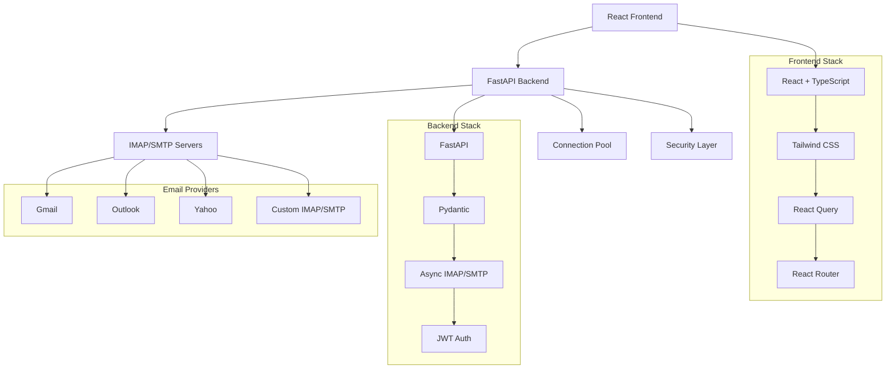

<div align="center">

# 📧 ConnexxionEngine Email Management System


*A secure, modern, and feature-rich email management system with a beautiful web interface*

[🚀 Quick Start](#-quick-start) • [📖 Documentation](#-comprehensive-documentation) • [🎯 Features](#-features) • [🏗️ Architecture](#%EF%B8%8F-system-architecture) • [🔧 API Reference](#-api-reference)

</div>

---

## ✨ Overview

ConnexxionEngine is a comprehensive, enterprise-grade email management platform that combines a powerful FastAPI backend with a modern React frontend. It provides secure email operations through IMAP/SMTP protocols while offering an intuitive web interface for seamless email management.

### 🎯 Key Highlights

- **🔐 Enterprise Security**: AES-256-GCM encryption, JWT authentication, SSL/TLS protocols
- **🌐 Universal Compatibility**: Works with Gmail, Outlook, Yahoo, and any IMAP/SMTP provider
- **⚡ High Performance**: Async operations, connection pooling, optimized queries
- **🎨 Modern UI**: Beautiful React interface with dark/light themes and responsive design
- **📱 Full-Featured**: Complete email client with compose, search, folders, attachments
- **🔄 Real-time**: Live updates and synchronization with email servers
- **🛠️ Developer-Friendly**: Comprehensive API documentation and testing tools

---

## 🎯 Features

<div align="center">

| Category | Features |
|----------|----------|
| **🔒 Security** | • AES-256-GCM credential encryption<br>• JWT-based authentication<br>• SSL/TLS connections<br>• CORS protection<br>• Secure session management |
| **📧 Email Operations** | • Send/receive emails with attachments<br>• Draft management and auto-save<br>• Rich text composition<br>• Email search and filtering<br>• Bulk operations (delete, archive, star) |
| **📁 Organization** | • Multi-folder support (Inbox, Sent, Drafts, etc.)<br>• Email starring and flagging<br>• Archive and spam management<br>• Folder-based navigation |
| **🎨 User Interface** | • Modern React + TypeScript frontend<br>• Dark/Light theme support<br>• Responsive design<br>• Keyboard shortcuts<br>• Virtual scrolling for performance |
| **🔧 Developer Tools** | • Interactive API documentation<br>• Comprehensive TypeScript types<br>• Error handling and logging<br>• Testing utilities |
| **⚡ Performance** | • Connection pooling<br>• Async operations<br>• Batched email fetching<br>• Optimized IMAP queries<br>• Client-side caching |

</div>

---

## 🏗️ System Architecture



### 🏛️ Architecture Components

#### **Frontend (React + TypeScript)**
- **React 18**: Modern React with hooks and concurrent features
- **TypeScript**: Full type safety and developer experience
- **Tailwind CSS**: Utility-first styling with custom design system
- **React Query**: Data fetching, caching, and synchronization
- **React Router**: Client-side routing and navigation
- **Vite**: Fast development server and build tool

#### **Backend (FastAPI + Python)**
- **FastAPI**: High-performance async web framework
- **Pydantic**: Data validation and serialization
- **aioimaplib/aiosmtplib**: Async IMAP/SMTP operations
- **Cryptography**: AES-256-GCM encryption for credentials
- **PyJWT**: JSON Web Token implementation
- **Connection Pooling**: Efficient resource management

#### **Security Layer**
- **Encryption**: All credentials encrypted with AES-256-GCM
- **Authentication**: JWT tokens with configurable expiration
- **Transport Security**: SSL/TLS for all email connections
- **CORS**: Configurable cross-origin resource sharing
- **Session Management**: Secure credential storage

---

## 🚀 Quick Start

### 📋 Prerequisites

- **Python 3.11+** (Backend)
- **Node.js 18+** (Frontend)
- **npm or yarn** (Package manager)

### ⚡ Installation

1. **Clone the repository**
   ```bash
   git clone https://github.com/your-username/connexxion-engine.git
   cd connexxion-engine
   ```

2. **Backend Setup**
   ```bash
   # Install Python dependencies
   pip install -r requirements.txt
   
   # Set environment variables (optional for development)
   export AES_SECRET_KEY="your-32-byte-base64-key"
   export JWT_SECRET_KEY="your-jwt-secret"
   
   # Start the backend server
   uvicorn app.main:app --reload --host 0.0.0.0 --port 8000
   ```

3. **Frontend Setup**
   ```bash
   cd frontend
   
   # Install dependencies
   npm install
   
   # Start development server
   npm run dev
   ```

4. **Access the Application**
   - **Frontend**: http://localhost:5173
   - **Backend API**: http://localhost:8000
   - **API Documentation**: http://localhost:8000/docs
   - **Alternative Docs**: http://localhost:8000/redoc

### 🔑 Environment Configuration

Create a `.env` file in the root directory:

```env
# Application Settings
APP_NAME=ConnexxionEngine
DEBUG=true

# Security (Generate secure keys for production)
AES_SECRET_KEY=your-base64-encoded-32-byte-key
JWT_SECRET_KEY=your-jwt-signing-secret
JWT_EXPIRES_MINUTES=1440

# CORS (Frontend URL)
CORS_ORIGINS=http://localhost:5173,http://localhost:3000

# Email Settings
SMTP_USE_SSL=true
IMAP_USE_SSL=true
CONNECTION_CLEANUP_INTERVAL=300
```

---

## 📖 Comprehensive Documentation

### 🎮 User Guide

#### **Getting Connected**
1. **Choose Email Provider**: Select from Gmail, Outlook, Yahoo, or configure custom IMAP/SMTP
2. **Enter Credentials**: Provide email and password (or OAuth token)
3. **Test Connection**: System validates connectivity before proceeding
4. **Start Managing**: Access your emails through the beautiful web interface

#### **Email Provider Setup**

<details>
<summary><strong>📩 Gmail Setup</strong></summary>

1. Enable 2-factor authentication
2. Generate an App Password:
   - Go to Google Account settings
   - Security → 2-Step Verification → App passwords
   - Generate password for "Mail"
3. Use the app password instead of your regular password

**Settings:**
- IMAP: `imap.gmail.com:993` (SSL)
- SMTP: `smtp.gmail.com:465` (SSL)

</details>

<details>
<summary><strong>📨 Outlook Setup</strong></summary>

1. Enable IMAP in Outlook settings
2. Use your regular email and password
3. For 2FA accounts, generate an app password

**Settings:**
- IMAP: `outlook.office365.com:993` (SSL)
- SMTP: `smtp.office365.com:587` (TLS)

</details>

<details>
<summary><strong>📬 Yahoo Setup</strong></summary>

1. Enable "Less secure app access" or use app password
2. Generate app password if 2FA is enabled

**Settings:**
- IMAP: `imap.mail.yahoo.com:993` (SSL)
- SMTP: `smtp.mail.yahoo.com:465` (SSL)

</details>

#### **Interface Overview**

- **📥 Inbox**: View and manage incoming emails
- **📤 Sent**: Review sent email history
- **📝 Drafts**: Access saved email drafts
- **🗑️ Trash**: Manage deleted emails
- **📦 Archive**: Organized email storage
- **⚠️ Spam**: Spam and junk email management

#### **Keyboard Shortcuts**

| Shortcut | Action |
|----------|--------|
| `c` | Compose new email |
| `/` | Search emails |
| `j` / `k` | Navigate up/down |
| `x` | Select email |
| `r` | Reply |
| `a` | Reply all |
| `f` | Forward |
| `e` | Archive |
| `#` | Delete |
| `s` | Star/unstar |
| `i` | Mark as read/unread |

### 🔧 API Reference

#### **Authentication**

All endpoints (except `/connect`) require credentials in one of three ways:

1. **Request Body** (Recommended)
   ```json
   {
     "creds": {
       "email": "user@example.com",
       "password": "password",
       "imap_host": "imap.gmail.com",
       "imap_port": 993,
       "smtp_host": "smtp.gmail.com",
       "smtp_port": 465
     }
   }
   ```

2. **Headers**
   ```
   X-Email: user@example.com
   X-Password: password
   X-IMAP-Host: imap.gmail.com
   X-IMAP-Port: 993
   X-SMTP-Host: smtp.gmail.com
   X-SMTP-Port: 465
   ```

3. **Query Parameters**
   ```
   ?email=user@example.com&password=password&imap_host=imap.gmail.com...
   ```

#### **Core Endpoints**

<details>
<summary><strong>🔌 Connection Management</strong></summary>

**POST `/api/connect`** - Validate email server credentials

```typescript
// Request
interface ConnectRequest {
  email: string;
  password?: string;
  access_token?: string;
  imap_host: string;
  imap_port: number;
  smtp_host: string;
  smtp_port: number;
}

// Response
interface ConnectResponse {
  success: boolean;
  message?: string;
}
```

</details>

<details>
<summary><strong>📧 Email Operations</strong></summary>

**POST `/api/emails/folders`** - List available folders

**POST `/api/emails/inbox`** - Get inbox emails (paginated)

**POST `/api/emails/sent`** - Get sent emails

**POST `/api/emails/drafts`** - Get draft emails

**POST `/api/emails/{email_id}`** - Get email details

**POST `/api/emails/compose`** - Save email draft

**POST `/api/emails/send`** - Send email

```typescript
// List Request
interface ListRequest {
  creds: Credentials;
  page?: number;        // Default: 1
  size?: number;        // Default: 50, max: 200
  search_text?: string;
  is_starred?: boolean;
  read_status?: boolean;
}

// Email Item
interface EmailItem {
  id: number;
  folder: string;
  subject?: string;
  from_address?: string;
  to_addresses: string[];
  is_read: boolean;
  timestamp?: string;
  has_attachments: boolean;
  is_flagged: boolean;
}
```

</details>

<details>
<summary><strong>🛠️ Email Management</strong></summary>

**POST `/api/emails/{email_id}/read`** - Mark as read/unread

**POST `/api/emails/{email_id}/star`** - Star/unstar email

**POST `/api/emails/{email_id}/delete`** - Move to trash

**POST `/api/emails/{email_id}/archive`** - Archive email

**POST `/api/emails/{email_id}/spam`** - Mark as spam

**POST `/api/emails/{email_id}/restore`** - Restore from trash

</details>

<details>
<summary><strong>📎 Attachment Handling</strong></summary>

**POST `/api/emails/{email_id}/attachments/{filename}`** - Download attachment

```typescript
interface AttachmentIn {
  filename: string;
  content_base64: string;  // Base64-encoded content
  content_type?: string;
}
```

</details>

### 🔐 Security

#### **Encryption & Authentication**
- **AES-256-GCM**: All credentials encrypted before storage
- **JWT Tokens**: Stateless authentication with configurable expiration
- **SSL/TLS**: All email server connections use encrypted protocols
- **HTTPS**: Enforce HTTPS in production environments

#### **Best Practices**
- Use app passwords for email providers with 2FA
- Store credentials securely (session storage, not localStorage)
- Implement proper CORS policies
- Use environment variables for sensitive configuration
- Enable debug logging only in development

---

## 🚀 Deployment

### 🐳 Docker Deployment (Recommended)

1. **Create Dockerfile** (if not exists):
   ```dockerfile
   FROM python:3.11-slim
   
   WORKDIR /app
   COPY requirements.txt .
   RUN pip install -r requirements.txt
   
   COPY app/ ./app/
   
   EXPOSE 8000
   CMD ["uvicorn", "app.main:app", "--host", "0.0.0.0", "--port", "8000"]
   ```

2. **Build and Run**:
   ```bash
   # Build image
   docker build -t connexxion-engine .
   
   # Run container
   docker run -p 8000:8000 --env-file .env connexxion-engine
   ```

3. **Docker Compose** (Full Stack):
   ```yaml
   version: '3.8'
   services:
     backend:
       build: .
       ports:
         - "8000:8000"
       environment:
         - AES_SECRET_KEY=${AES_SECRET_KEY}
         - JWT_SECRET_KEY=${JWT_SECRET_KEY}
     
     frontend:
       build: ./frontend
       ports:
         - "80:80"
       depends_on:
         - backend
   ```

### 🌐 Production Deployment

#### **Backend (FastAPI)**
```bash
# Install dependencies
pip install -r requirements.txt

# Set production environment variables
export AES_SECRET_KEY="your-production-key"
export JWT_SECRET_KEY="your-production-jwt-secret"
export DEBUG=false
export CORS_ORIGINS="https://yourdomain.com"

# Start with production WSGI server
gunicorn app.main:app -w 4 -k uvicorn.workers.UvicornWorker --bind 0.0.0.0:8000
```

#### **Frontend (React)**
```bash
cd frontend

# Build for production
npm run build

# Serve static files (nginx, Apache, or CDN)
cp -r dist/* /var/www/html/
```

#### **Environment Variables**

| Variable | Description | Required | Default |
|----------|-------------|----------|--------|
| `APP_NAME` | Application name | No | ConnexxionEngine |
| `DEBUG` | Enable debug mode | No | false |
| `AES_SECRET_KEY` | 32-byte Base64 encryption key | **Yes** | - |
| `JWT_SECRET_KEY` | JWT signing secret | **Yes** | - |
| `JWT_EXPIRES_MINUTES` | JWT token expiration | No | 1440 (24h) |
| `CORS_ORIGINS` | Allowed origins (comma-separated) | No | localhost:5173 |
| `SMTP_USE_SSL` | Use SSL for SMTP | No | true |
| `IMAP_USE_SSL` | Use SSL for IMAP | No | true |
| `CONNECTION_CLEANUP_INTERVAL` | Pool cleanup interval (seconds) | No | 300 |

---

## 🛠️ Development

### 🛠️ Development Setup

```bash
# Clone repository
git clone https://github.com/your-username/connexxion-engine.git
cd connexxion-engine

# Backend development
pip install -r requirements.txt
uvicorn app.main:app --reload

# Frontend development
cd frontend
npm install
npm run dev

# Run tests
python -m pytest
npm test
```

### 📁 Project Structure

```
connextion-engine/
├── app/                    # FastAPI Backend
│   ├── api/
│   │   └── routes/         # API endpoints
│   ├── core/               # Core functionality
│   │   ├── auth.py         # Authentication
│   │   ├── config.py       # Configuration
│   │   ├── connection_pool.py # Connection management
│   │   └── security.py     # Security utilities
│   ├── schemas/            # Pydantic models
│   ├── services/           # Business logic
│   │   ├── email_service.py # Core email operations
│   │   ├── imap_operations.py # IMAP functionality
│   │   └── smtp_operations.py # SMTP functionality
│   └── main.py            # Application entry point
├── frontend/              # React Frontend
│   ├── src/
│   │   ├── components/    # React components
│   │   ├── contexts/      # React contexts
│   │   ├── hooks/         # Custom hooks
│   │   ├── pages/         # Page components
│   │   ├── services/      # API services
│   │   ├── types/         # TypeScript types
│   │   └── utils/         # Utility functions
│   └── package.json
├── requirements.txt       # Python dependencies
├── README.md             # This file
└── docs/                 # Additional documentation
```

### 🧪 Testing

```bash
# Backend tests
python -m pytest tests/ -v

# Frontend tests
cd frontend
npm test

# E2E tests
npm run test:e2e
```

---

## 🤝 Contributing

We welcome contributions! Please see our contributing guidelines:

1. **Fork the repository**
2. **Create a feature branch**: `git checkout -b feature/amazing-feature`
3. **Commit changes**: `git commit -m 'Add amazing feature'`
4. **Push to branch**: `git push origin feature/amazing-feature`
5. **Open a Pull Request**

### 📝 Development Guidelines

- Follow PEP 8 for Python code
- Use TypeScript for all frontend code
- Write tests for new features
- Update documentation as needed
- Follow conventional commit messages

---

## 📊 Performance & Monitoring

### ⚡ Performance Features

- **Connection Pooling**: Reuse IMAP/SMTP connections
- **Async Operations**: Non-blocking I/O for better throughput
- **Batched Fetching**: Efficient email list retrieval
- **Client Caching**: Reduce API calls with React Query
- **Virtual Scrolling**: Handle large email lists efficiently

### 📈 Monitoring

- **Structured Logging**: JSON formatted logs for analysis
- **Health Checks**: `/healthz` endpoint for monitoring
- **Error Tracking**: Comprehensive error handling and reporting
- **Performance Metrics**: Built-in timing and performance data

---

## 🔧 Troubleshooting

### Common Issues

<details>
<summary><strong>🔑 Authentication Failures</strong></summary>

**Problem**: "Authentication failed" errors

**Solutions**:
- Check if 2FA is enabled (use app passwords)
- Verify IMAP/SMTP server settings
- Ensure "Less secure app access" is enabled (if applicable)
- Check firewall and network connectivity

</details>

<details>
<summary><strong>🌐 CORS Errors</strong></summary>

**Problem**: Frontend cannot connect to backend

**Solutions**:
- Add frontend URL to `CORS_ORIGINS` environment variable
- Check if both frontend and backend are running
- Verify API base URL in frontend configuration

</details>

<details>
<summary><strong>📧 Email Not Sending</strong></summary>

**Problem**: Emails are not being sent

**Solutions**:
- Verify SMTP credentials and settings
- Check if port 587/465 is blocked by firewall
- Ensure SSL/TLS settings match server requirements
- Check email server logs for detailed errors

</details>

### 🐛 Debug Mode

Enable debug logging:

```bash
export DEBUG=true
export LOG_LEVEL=DEBUG
```

Check logs in `email_engine.log` or console output.

---

## 🗺️ Roadmap

### 🎯 Upcoming Features

- [ ] **OAuth2 Integration** - Direct Gmail/Outlook OAuth support
- [ ] **Email Templates** - Pre-designed email templates
- [ ] **Calendar Integration** - Meeting scheduling and calendar sync
- [ ] **Mobile App** - React Native mobile application
- [ ] **Plugin System** - Extensible plugin architecture
- [ ] **Advanced Search** - Full-text search with advanced filters
- [ ] **Email Rules** - Automated email processing and filtering
- [ ] **Multi-Account** - Support for multiple email accounts
- [ ] **Offline Mode** - Email access without internet connection
- [ ] **Analytics Dashboard** - Email usage analytics and insights

### 🚀 Performance Improvements

- [ ] **Redis Caching** - Improved caching with Redis
- [ ] **WebSocket Support** - Real-time email notifications
- [ ] **Background Jobs** - Async email processing
- [ ] **CDN Integration** - Faster asset delivery
- [ ] **Progressive Web App** - PWA capabilities

---

## 📄 License

Copyright © 2024 ConnexxionEngine. All rights reserved.

This project is licensed under the MIT License - see the [LICENSE](LICENSE) file for details.

---

## 🙏 Acknowledgments

- **FastAPI** - For the excellent async web framework
- **React Team** - For the amazing frontend library
- **Tailwind CSS** - For the utility-first CSS framework
- **Contributors** - Thank you to all contributors who make this project better

---

<div align="center">

**⭐ Star this repository if you find it helpful!**

[🐛 Report Bug](https://github.com/your-username/connexxion-engine/issues) • [✨ Request Feature](https://github.com/your-username/connexxion-engine/issues) • [💬 Discussions](https://github.com/your-username/connexxion-engine/discussions)

**Built with ❤️ by the ConnexxionEngine Team**

</div>
